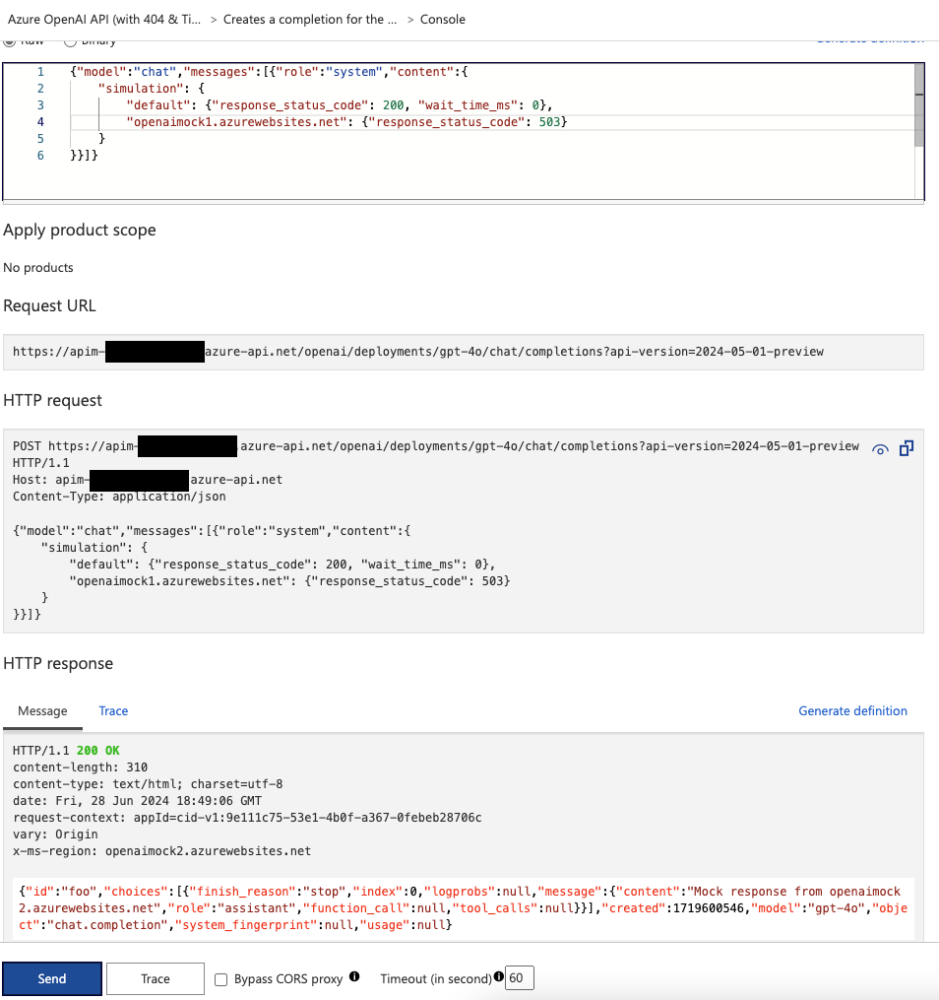

# APIM Retry Policy Configuration Tweaks

All the tests you can see in this repo were done using the AI Hub Landing Zone repo: [AI Hub Gateway Solution Accelerator](https://github.com/Azure-Samples/ai-hub-gateway-solution-accelerator).

Additionally, I've configured the mock backends published here for testing: [Mock Server](https://github.com/Azure-Samples/AI-Gateway/blob/main/tools/mock-server/app.py).

## Overview of Configured Mock Servers

*`list-of-backends.png` shows the configured mock servers.*

*`list-of-backends-policy-config.png` shows the configuration on the API-level of the mock servers.*

## Failover Scenarios

### Out of the Box Failover

*`failover-503.png` works out of the box.*

*`failover-429.png` works out of the box.*

- **503 errors** are important for failover as they can occur due to resource constraints.
- **429 errors** are common during normal operations, indicating that the quota is reached on one endpoint, necessitating the use of another one.

### Handling 404 Errors
A scenario not covered yet is when a model is updated to a new version and is unavailable for a period.

*`failover-404-notworking.png` shows this scenario.*

To address this, we can introduce failover on 404 by altering the backend routing fragment as shown in `backendrouting-added-404.png`.

After this change, you can see that 404 errors are correctly handled:

*`failover-404-working.png`*

### Addressing Higher Response Times on Embedding Endpoints
In case you would like to failover the embedding endpoint when you expierenced higher response times, one option is to failover to a secondary endpoint if the response time exceeds a certain threshold.

> :warning: **Warning:** It's crucial to apply this fragment only to the embedding endpoint because longer response times can be normal for the chat endpoint as well, even when there are no issues.

Here is an example configuration to check the duration and failover accordingly (for testing, 30s was used, but you may want a higher threshold):

*`backendrouting-added-timeout.png`*

## Images
The images referenced are located in the root folder of this repository.
